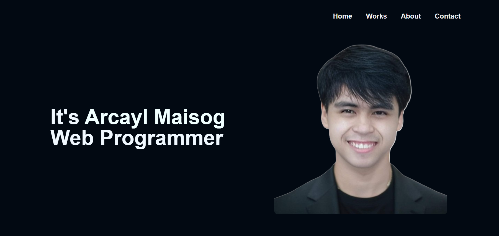

<h1 align="center">Welcome to Arcayl Maisog's Portfolio 👋</h1>

<hr/>

## A Simple Portfolio Template built with VueJS (Vite) + TailwindCss

<p align="center">
  <kbd>
    
  </kbd>
</p>

### **[Click here to see Demo](https://arcayl-portfolio.netlify.app/)**

## Sections

✔️ Home Page Banner  
✔️ Skills  
✔️ My Best Works  
✔️ Services Offered  
✔️ About Me  
✔️ Contact

## Getting Started

These instructions will get you a copy of the project up and running on your local machine for development and testing purposes.

### Prerequisites

- Node.js
- npm or yarn

### Installation

1. Clone the repo
   ```sh
   git clone https://github.com/kael8/portfolio.git
   ```
